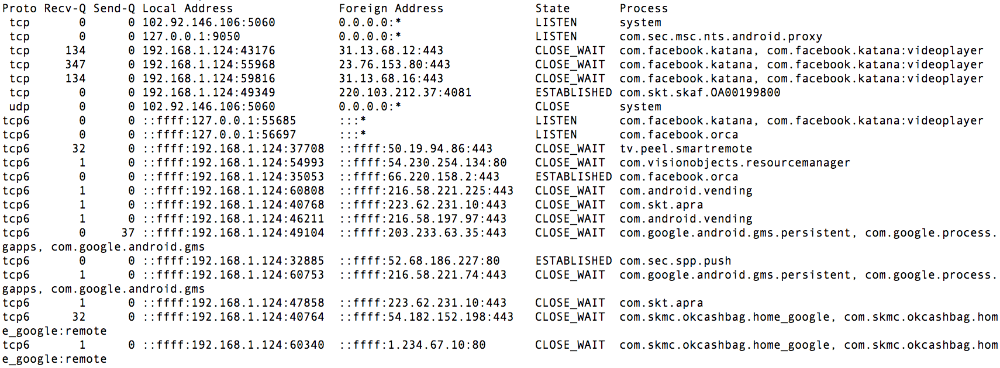

# netstat
netstat command with process names in Android adb shell

If the uid is 0 or 1000, its process name will be 'system' and shared uid has many process names.

I have changed toolbox's netstat in Android source code(~~https://android.googlesource.com/platform/system/core/+/master/toolbox/netstat.c~~).

UPDATE: The netstat in toolbox was removed in Android. And new netstat of toybox in Android Marshmallow(6.0) needs root priviledge to get PID or Process name, not this netstat.
## Example

## Installation
```bash
$> adb push netstat3 /data/local/tmp
```
## Configuration
```bash
$> adb shell
shell@xxx:/ $ chmod 755 /data/local/tmp/netstat3
```
## Run
```bash
shell@xxx:/ $ /data/local/tmp/netstat3
```
